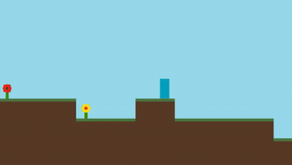

# Block

**Block** is a scrolled platformer game developed in C++ 
using only Windows API. Players traverse through a blocky world, 
navigating with arrow keys, jumping onto blocks to explore, while enjoying 
smooth camera movement for a seamless experience.

# Demo

# License

GPL-2.0 (see LICENSE file)

# Author

Antoni Michał Przybylik
